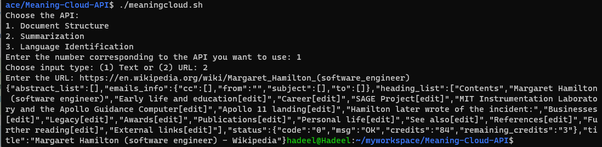
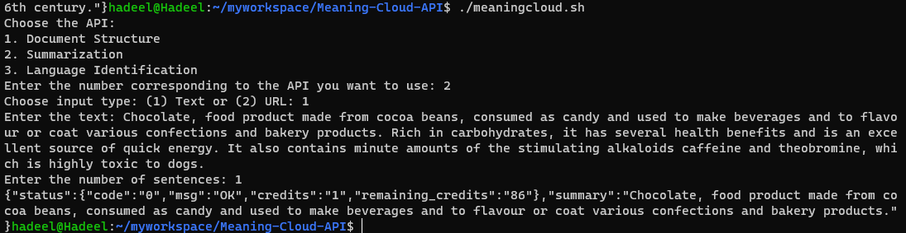
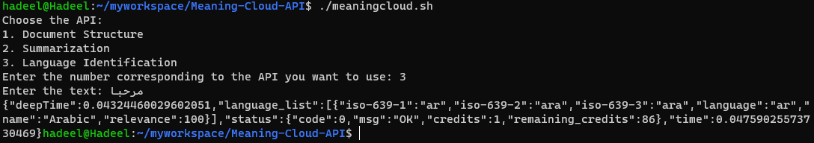
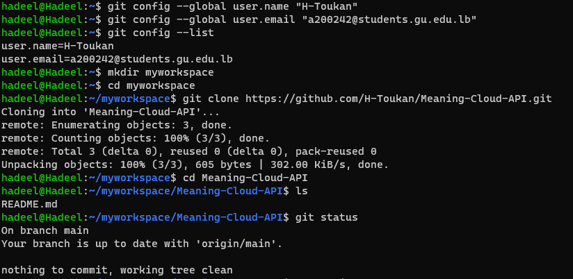
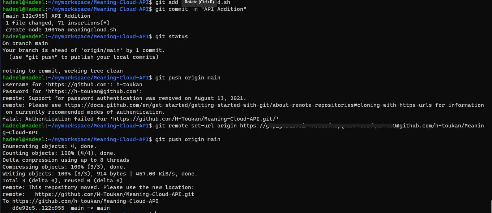

# Meaning-Cloud-API

This Bash script allows you to interact with MeaningCloud APIs for Document Structure, Summarization, and Language Identification.
## Prerequisites

Before using the script, make sure you have the following:

- MeaningCloud API key (replace 'YOUR_API_KEY' with your actual API key)

## Usage

1. Open a terminal.

2. Navigate to the directory where the script is located.

3. Make the script executable if needed:

    ```bash
    chmod +x meaningcloud.sh
    ```

4. Run the script:

    ```bash
    ./meaningcloud.sh
    ```

5. Follow the on-screen prompts to choose the API and provide necessary input.

## API Options

- Document Structure
- Summarization
- Language Identification

## Input Types

1. Text
2. URL

## Examples

### Document Structure

- Choose API: Document Structure
- Choose input type: Text
- Enter the text when prompted.
  

### Summarization

- Choose API: Summarization
- Choose input type: URL
- Enter the URL when prompted.
- Enter the number of sentences for the summary.


### Language Identification

- Choose API: Language Identification
- Enter the text when prompted.


## Tutorial To Edit Your Reporistory




## Author
Hadeel Toukan

For more information, visit the [MeaningCloud API Website](https://www.meaningcloud.com/developer/apis).
